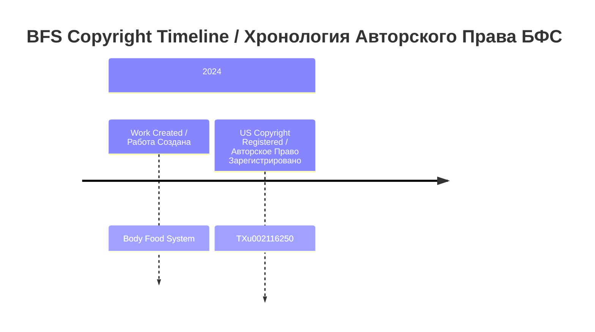

# Body Food System / Система Питания Человеческого Тела

**Abbreviation / Сокращение:**
- **EN:** BFS (Body Food System System)
- **RU:** БФС (Биологическая Функциональная Система)

---

## Quick Navigation / Быстрая Навигация

| Section / Раздел | Description / Описание | Status / Статус |
|------------------|----------------------|----------------|
| [Repository Overview / Обзор репозитория](#repository-overview--обзор-репозитория) | Copyright registration details / Детали регистрации авторского права | Complete / Завершено |
| [Invention Details / Детали изобретения](#invention-details--детали-изобретения) | Names, descriptions / Названия, описания | Complete / Завершено |
| [Technical Field / Область Техники](#technical-field--область-техники) | Scientific domains / Научные направления | Complete / Завершено |
| [Timeline / Временная Шкала](#timeline--временная-шкала) | Patent chronology / Хронология патента | Complete / Завершено |
| [Document Upload Status / Статус загрузки документов](#document-upload-status--статус-загрузки-документов) | Uploaded documents / Загруженные документы | Complete / Завершено |
| [Data Structure / Структура Данных](#data-structure--структура-данных) | Repository file tree / Дерево файлов репозитория | Complete / Завершено |
| [Active Issues / Активные Задачи](#active-issues--активные-задачи) | Tracked issues / Отслеживаемые задачи | Complete / Завершено |
| [ASRP Ecosystem / Экосистема ASRP](#asrp-ecosystem--экосистема-asrp) | Related repositories / Связанные репозитории | Complete / Завершено |
| [Related Links / Ссылки](#related-links--ссылки) | External resources / Внешние ресурсы | Complete / Завершено |

---

## Repository Overview / Обзор репозитория

| Metric / Метрика | Value / Значение |
|------------------|-----------------|
| **Copyright № / № Авторского Права** | TXu002116250 |
| **Registration Date / Дата Регистрации** | 2024 |
| **Status / Статус** | Registered / Зарегистрировано |
| **Copyright Office / Бюро Авторских Прав** | U.S. Copyright Office |
| **Country / Страна** | United States of America / Соединенные Штаты Америки |
| **Inventors / Изобретатели** | [TBD] |
| **Language / Язык** | English/Russian / Английский/Русский |

---

## Invention Details / Детали изобретения

### Full Names / Полные Названия

| Language / Язык | Full Name / Полное Название | Abbreviation / Сокращение |
|-----------------|---------------------------|--------------------------|
| **English / Английский** | Body Food System System | BFS |
| **Russian / Русский** | Система Питания Человеческого Тела | БФС |
| **Scientific / Научный (RU)** | Биологическая Функциональная Система | БФС |

### Description / Описание

**EN:** An innovative system for personalized nutrition based on genetic code analysis. The system provides individualized dietary recommendations based on an individual's genetic profile, optimizing health outcomes through precision nutrition.

**RU:** Инновационная система персонализированного питания на основе анализа генетического кода. Система предоставляет индивидуализированные диетические рекомендации на основе генетического профиля человека, оптимизируя результаты для здоровья через прецизионное питание.

---

## Technical Field / Область Техники

### ENGLISH
- Genetic Analysis
- Personalized Nutrition
- Health Technology
- Bioinformatics
- Precision Medicine

### РУССКИЙ
- Генетический Анализ
- Персонализированное Питание
- Технология Здоровья
- Биоинформатика
- Прецизионная Медицина

---

## Contact / Контакты

| Field / Поле | Value / Значение |
|--------------|------------------|
| **Organization / Организация** | Kazpatent / ASRP |
| **Email / Электронная Почта** | info@asrp.tech |
| **Website / Веб-сайт** | https://asrp.tech |

---

## Timeline / Временная Шкала

| Stage / Этап | Date / Дата | Status / Статус |
|--------------|------------|-----------------|
| **1. Application Filed / Заявка Подана** | 2024 | Complete / Завершено |
| **2. Registration / Регистрация** | 2024 | Complete / Завершено |

### Chronology Diagram / Диаграмма Хронологии



---

## Document Upload Status / Статус загрузки документов

### Application Documents / Документы заявки

| # | Document / Документ | Status / Статус | Direct Link / Прямая Ссылка |
|---|--------------------|-----------------|----------------------------|
| 1 | BFS Copyright Certificate / Свидетельство об Авторском Праве | Uploaded / Загружено | [ PDF](docs/applications/BFS_Copyright.pdf) |
| 2 | BFS System Description / Описание Системы | Uploaded / Загружено | [ PDF](docs/descriptions/BFS.pdf) |
| 3 | Vision Document / Визион Документ | Uploaded / Загружено | [ PDF](docs/descriptions/Vision%20Document.pdf) |
| 4 | SRS (Software Requirements Specification) / Спецификация Требований | Uploaded / Загружено | [ PDF](docs/specifications/SRS%20BFS.pdf) |

---

## Data Structure / Структура Данных

```
Kazpatent_Body_Food_System_Patent/
 README.md
 ISSUE_1_DOCUMENTATION.md
 docs/
     applications/
        BFS_Copyright.pdf
     descriptions/
        BFS.pdf
        Vision Document.pdf
     specifications/
         SRS BFS.pdf
```

---

## Active Issues / Активные Задачи

| # | Title / Название | Priority / Приоритет | Status / Статус | Link / Ссылка |
|---|-----------------|---------------------|----------------|---------------|
| 1 | Patent Documentation Upload / Загрузка Патентной Документации | CRITICAL / КРИТИЧНЫЙ | Complete / Завершено | [ISSUE_1_DOCUMENTATION.md](ISSUE_1_DOCUMENTATION.md) |

---

## ASRP Ecosystem / Экосистема ASRP

### Related Repositories / Связанные Репозитории

| Repository / Репозиторий | Direction / Направление | Link / Ссылка |
|--------------------------|------------------------|---------------|
| Hyperbolic Field Blood Plasma Study | Blood plasma coagulation / Коагуляция плазмы крови | [View / Смотреть](https://github.com/AdvancedScientificResearchProjects/Hyperbolic_Field_BloodPlasma_Study) |
| Hyperbolic Field Agricultural Study | Plant & seed growth / Рост растений и семян | [View / Смотреть](https://github.com/AdvancedScientificResearchProjects/Hyperbolic_Field_Agricultural_Study) |
| Hyperbolic Field DAAT Crystal Study | Crystal-human interaction / Взаимодействие кристаллов с человеком | [View / Смотреть](https://github.com/AdvancedScientificResearchProjects/Hyperbolic_Field_DAAT_Crystal_Study) |

### Patent Portfolio / Патентное Портфолио

| # | Patent / Патент | Number / Номер | Country / Страна | Type / Тип |
|---|----------------|---------------|-----------------|------------|
| 1 | Body Food System (BFS) | TXu002116250 | USA / США | Copyright / Авторское Право |
| 2 | Hyperbolic Field Generator | 36553 | Kazakhstan / Казахстан | Patent / Патент |
| 3 | Hyperbolic Field Generator (Innovation) | 8277 | Kazakhstan / Казахстан | Innovation Patent / Инновационный Патент |
| 4 | DAAT Crystal Production | 37070 | Kazakhstan / Казахстан | Patent / Патент |
| 5 | DAAT Crystal Production (Innovation) | 8502 | Kazakhstan / Казахстан | Innovation Patent / Инновационный Патент |
| 6 | Hyperbolic Field Application Method | 37321 | Kazakhstan / Казахстан | Patent / Патент |
| 7 | Hyperbolic Field Application Method (Innovation) | 8609 | Kazakhstan / Казахстан | Innovation Patent / Инновационный Патент |

---

## Related Links / Ссылки

| Resource / Ресурс | URL |
|------------------|-----|
| **Copyright Record / Запись об Авторском Праве** | https://publicrecords.copyright.gov/detailed-record/30445851 |
| **PDF Document / PDF Документ** | https://api.publicrecords.copyright.gov/search_service_external/copyrights/pdf?copyright_number=TXu002116250 |
| **Media Coverage / Публикация в СМИ** | https://www.if24.ru/pitanie-po-geneticheskomu-kodu/ |

---

## Keywords / Ключевые Слова

**EN:** Patent, Body Food System, Genetic Code, Personalized Nutrition, Health Technology, Kazpatent, BFS, TXu002116250
**RU:** Патент, Система Питания, Генетический Код, Персонализированное Питание, Технология Здоровья, Kazpatent, БФС, TXu002116250

---

## Legal Notice / Правовое Уведомление

**EN:** This document contains proprietary information protected by copyright and patent law. Unauthorized use is prohibited.
**RU:** Этот документ содержит конфиденциальную информацию, защищенную авторским правом и патентным законом. Несанкционированное использование запрещено.

---

## Navigation Index / Навигационный Индекс

- [Quick Navigation / Быстрая Навигация](#quick-navigation--быстрая-навигация)
- [Repository Overview / Обзор репозитория](#repository-overview--обзор-репозитория)
- [Invention Details / Детали изобретения](#invention-details--детали-изобретения)
- [Technical Field / Область Техники](#technical-field--область-техники)
- [Contact / Контакты](#contact--контакты)
- [Timeline / Временная Шкала](#timeline--временная-шкала)
- [Document Upload Status / Статус загрузки документов](#document-upload-status--статус-загрузки-документов)
- [Data Structure / Структура Данных](#data-structure--структура-данных)
- [Active Issues / Активные Задачи](#active-issues--активные-задачи)
- [ASRP Ecosystem / Экосистема ASRP](#asrp-ecosystem--экосистема-asrp)
- [Related Links / Ссылки](#related-links--ссылки)
- [Keywords / Ключевые Слова](#keywords--ключевые-слова)
- [Legal Notice / Правовое Уведомление](#legal-notice--правовое-уведомление)

---

**Created / Создано:** 2024
**Last Updated / Последнее Обновление:** 2026-04-03
**Version / Версия:** 1.1
**Copyright Number / Номер Авторского Права:** TXu002116250
